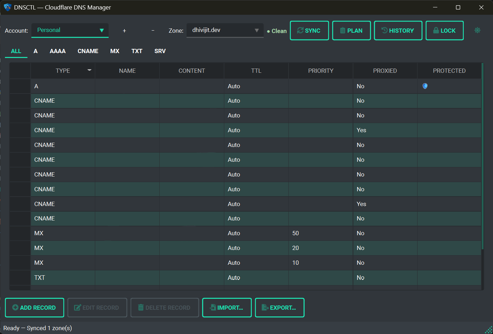
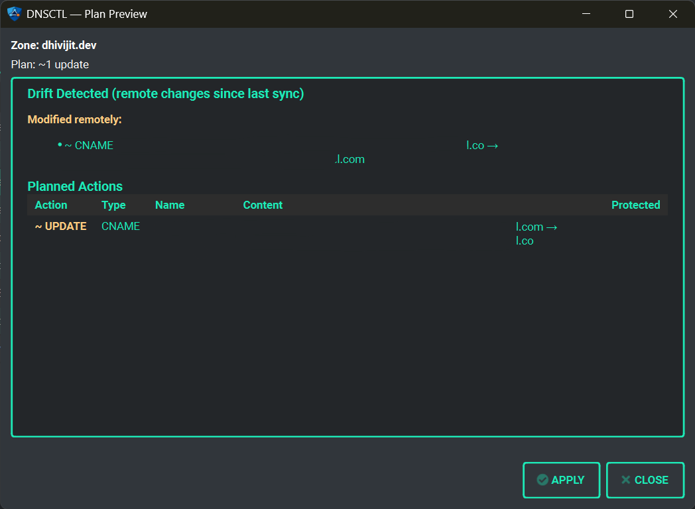

<div align="center">


# DNSCTL

**Secure, version-controlled DNS management for Cloudflare**

[](https://pypi.org/project/dnsctl-app/)
[](https://pypi.org/project/dnsctl-app/)
[](LICENSE)
[](https://github.com/dhivijit/dnsctl/releases)

</div>

DNSCTL is a local infrastructure tool for managing Cloudflare DNS records safely. It brings a Git-backed state model, drift detection, and a plan/apply workflow to DNS — so you always know what changed, when, and why.

It ships as both a **CLI** for scripting and automation, and a **GUI** for interactive use — both powered by the same reconciliation engine.

---

## How it works

```
1. sync     Pull live DNS records from Cloudflare into local state
2. edit     Add, edit, or delete records locally (no live changes yet)
3. plan     Preview exactly what will be pushed to Cloudflare
4. apply    Push the confirmed changes
5. history  Every change auto-committed to a local Git repo
```

No change touches Cloudflare until you explicitly apply it.

---

## ✨ Features

- **Drift Detection** — Spot out-of-band dashboard changes before they cause issues
- **Plan / Apply Workflow** — Review a diff before any record is touched
- **Git-Backed History** — Every sync and edit auto-committed; full rollback support
- **Secure Token Storage** — AES-256-GCM encrypted, key derived via PBKDF2, stored in OS keyring
- **Session Locking** — Token cached in memory, auto-expires after inactivity
- **Multi-Account** — Manage multiple Cloudflare accounts; one master password unlocks all
- **Protected Records** — System-level (NS) and user-defined guards that require `--force` to override
- **CLI + GUI Parity** — Every feature available in both interfaces

---

## 📦 Installation

### From PyPI (macOS / Linux / Windows)

```bash
pip install dnsctl-app
```

> Requires Python 3.11+ and Git.
> On Linux, ensure a keyring backend is available (e.g. `gnome-keyring` or `kwallet`).

### Windows Installer

Download the bundled installer from the [Releases](https://github.com/dhivijit/dnsctl/releases) page.
Includes both CLI (`dnsctl.exe`) and GUI (`dnsctl-g.exe`) with all dependencies — no Python required.

### From Source

```bash
git clone https://github.com/dhivijit/dnsctl.git
cd dnsctl
pip install -e .
```

---

## 🚀 Quick Start

### 1. Add your Cloudflare account

```bash
dnsctl login
```

You'll be prompted for an account name, your Cloudflare API token, and a master password. The token is encrypted and stored in your OS keyring — never in plaintext.


### 2. Unlock your session

```bash
dnsctl unlock
```

Decrypts the token into a short-lived session. One password unlocks all your accounts at once.

### 3. Pull your DNS records

```bash
dnsctl sync
```

### 4. Make a local change

```bash
dnsctl add --type A --name staging.example.com --content 1.2.3.4
```

Nothing is sent to Cloudflare yet.

### 5. Review the plan

```bash
dnsctl plan
```

### 6. Apply

```bash
dnsctl apply
```

---

## 🖥 GUI

Launch the graphical interface:

```bash
dnsctl-g
```





Features:

- Zone selector with drift status indicator
- Record table with add / edit / delete dialogs
- Sync, Plan, and Apply controls
- History viewer and rollback
- Multi-account switcher
- Session unlock dialog

The GUI uses the same reconciliation engine as the CLI — no feature gap between them.

---

## 🧰 CLI Reference

### Authentication

```bash
dnsctl login              # Add a Cloudflare account (encrypted)
dnsctl unlock             # Unlock session with master password
dnsctl lock               # Lock session manually
dnsctl logout             # Remove stored credentials for current account
```

### Sync & Status

```bash
dnsctl sync [-z ZONE]     # Pull records from Cloudflare
dnsctl status             # Show accounts, zones, and session state
dnsctl diff [-z ZONE]     # Show drift between local state and Cloudflare
dnsctl plan [-z ZONE]     # Preview what apply would push
dnsctl apply [-z ZONE]    # Push planned changes to Cloudflare
```

### Record Management

```bash
dnsctl add  --type A --name sub.example.com --content 1.2.3.4
dnsctl edit --type A --name sub.example.com --content 5.6.7.8
dnsctl rm   --type A --name sub.example.com
```

### Protected Records

```bash
dnsctl protect   --type A --name example.com --reason "Critical root record"
dnsctl unprotect --type A --name example.com
dnsctl protected
```

### History & Rollback

```bash
dnsctl log
dnsctl rollback <commit_sha>
```

### Import / Export

```bash
dnsctl export [-z ZONE] [-o output.json]
dnsctl import zone.json
```

### Account Management

```bash
dnsctl accounts list
dnsctl accounts switch <alias>
dnsctl accounts remove <alias>
```

---

## 👥 Multi-Account Support

DNSCTL supports multiple Cloudflare accounts side by side, each with isolated zone state.

```bash
# Add accounts
dnsctl login                        # prompts for account name + token + password
dnsctl login --label "Work"         # with explicit label

# Switch between accounts
dnsctl accounts list
dnsctl accounts switch work

# Remove an account
dnsctl accounts remove personal
```

All accounts share a single master password. Unlocking one automatically unlocks all others in the same session.

---

## 🔐 Security Model

### Token storage

- API token encrypted with **AES-256-GCM**
- Encryption key derived via **PBKDF2-HMAC-SHA256** (200,000 iterations)
- Encrypted blob stored in the **OS keyring** (Windows Credential Manager / macOS Keychain / Linux Secret Service)
- Plaintext token held in memory only for the duration of the session, then discarded

### Session

- Session expires automatically after inactivity (default: 15 minutes)
- `dnsctl lock` expires the session immediately
- `dnsctl logout` removes all stored credentials for an account

### Protected records

Two layers:

1. **System-protected** — NS records are always protected
2. **User-defined** — mark any record with `dnsctl protect`; requires `--force` to override in apply

---

## 🤝 Contributing

Pull requests are welcome. For larger changes, open an issue first to discuss the approach.

```bash
git clone https://github.com/dhivijit/dnsctl.git
cd dnsctl
pip install -e ".[dev]"
pytest
```

---

## 📜 License

MIT License — © Dhivijit
